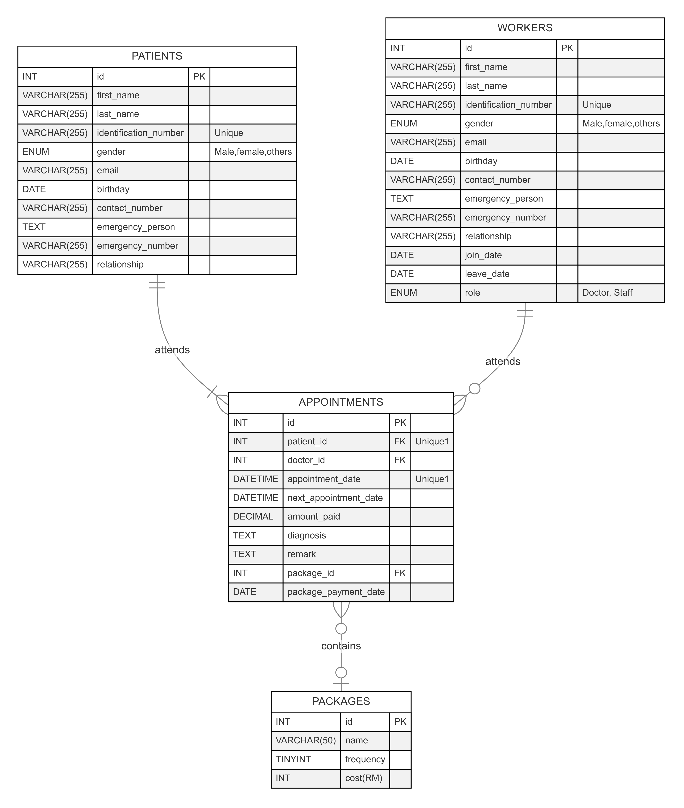
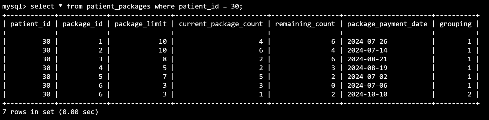
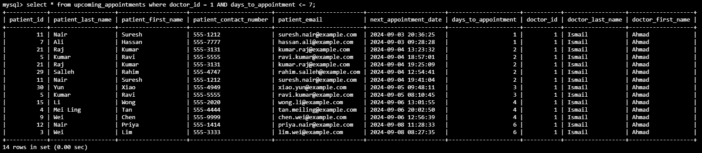

# Design Document
By TAI WEI JIAN BRYAN

This is a final project as required to complete the "CS50’s Introduction to Databases with SQL" course (https://cs50.harvard.edu/sql/2024/).

Through this course, I have gained knowledge and practices on:
1. Data operations: Master how to create, read, update and delete data in relational databases.
2. Data modeling: Understand how to model real-world entities and relationship using tables, applying appropriate type, triggers & constraints.
3. Data normalization: Learn how to normalize data to eliminate redundancies.
4. Table joins: Gain skills in joining tables using primary and foreign keys to represent relationship between entities.
5. Search optimization: Learn how to automate searches using views and speed up searches with indexes.
6. Database systems: Start with SQLite for portability, and get introduced to PostgreSQL and MySQL for scalability.

## Scope

This database simulates a clinic management system, designed for use by clinic workers to manage and track patient care. It stores detailed information about the clinic's workers and patients, along with the appointment details for each patient.

The database also supports the management of treatment packages, which are additional treatments that a patient can receive during their appointments. For example, a package might include 10 sessions of acupuncture for a total cost of $1000. The patient is required to pay for the full package at the start of the treatment, and this payment is recorded in the database. When inserting a new appointment entry, logic is in place to prevent any invalid entries, such as utilizing a new package without payment, duplicate payments, or exceeding the package limit.

The database is structured to capture key information related to each appointment, including the patient diagnosis, any remarks by the doctor, and details of the package (if applicable).

## Functional Requirements

<!-- In this section you should answer the following questions:

* What should a user be able to do with your database?
* What's beyond the scope of what a user should be able to do with your database? -->

The user will be able to:

Insert:
* Patients' personal info (name, identification number, phone number etc.)
* Workers' personal info (name, identification number, phone number, join date, leave date etc.)
* Appointment details (attending doctor, patient id, diagnosis, remarks, additional package, package payment date etc.)
* Treatment packages (treatment name, cost, frequency.)

Retrieve insights from the databases, including:
* The number of doctors currently employed in the clinic.
* The total number of patients who have visited the clinic.
* The utilization rate of each doctor.
* The increase in patient numbers over time.
* The doctor's schedule for the week.
* The average cost of treatment per week.
* The most common treatment package utilized by patients.

The database is not designed to:
* Handle complex billing or insurance processes beyond simple package payments.
* Manage inventory or supplies used during treatments.

## Representation

### Entities

<!-- In this section you should answer the following questions:

* Which entities will you choose to represent in your database?
* What attributes will those entities have?
* Why did you choose the types you did?
* Why did you choose the constraints you did? -->
There are 4 tables in the `clinic` database.
1. `workers` Table:
Purpose: This table stores information about all the workers in the clinic, including both doctors and staff.

&emsp; Columns:
* `id`: An `AUTO_INCREMENT` `INT` `PRIMARY KEY` unique identifier for each worker.
* `first_name`: A `VARCHAR(255)` column that stores worker's first name.
* `last_name`: A `VARCHAR(255)` column that stores worker's last name.
* `identification_number`: A `VARCHAR(255)` column that stores worker's identification number and has a `UNIQUE` constraint, ensuring that no two workers can have the same identification number.
* `gender`: An `ENUM` column that stores worker's gender ("male", "female", "others").
* `email`: A `VARCHAR(255)` column that stores worker's email.
* `birthday`: A `DATE` column that stores worker's birthday.
* `contact_number`: A `VARCHAR(255)` column that stores worker's phone number.
* `emergency_person`: A `TEXT` column that stores worker's emergency contact person's name.
* `emergency_number`: A `VARCHAR(255)` column that stores worker's emergency contact person's phone number.
* `relationship`: A `VARCHAR(255)` column that stores worker's relationship with the emergency contact person.
* `join_date`: A `DATE` column that stores worker's employment join date.
* `leave_date`: A `DATE` column that stores worker's employment termination date. An optional column as only employees that left needs to fill in.
* `role`: An `ENUM` column that stores worker's role ("Doctor", "Staff").

&emsp; Constraints:
* `NOT NULL`: Applied to all columns except `leave_date` and `email`.

 

2. `patients` Table:
* Purpose: This table stores the personal details of the clinic's patients.

&emsp; Columns:
* `id`: An `AUTO_INCREMENT` `INT` `PRIMARY KEY` unique identifier for each patient.
* `first_name`: A `VARCHAR(255)` column that stores patient's first name.
* `last_name`: A `VARCHAR(255)` column that stores patient's last name.
* `identification_number`: A `VARCHAR(255)` column that stores patient's identification number and has a `UNIQUE` constraint, ensuring that no two patients can have the same identification number.
* `gender`: An `ENUM` field consisting of options such as "male", "female", "others".
* `email`: A `VARCHAR(255)` column that stores patient's email.
* `birthday`: A `DATE` column that stores patient's birthday.
* `contact_number`: A `VARCHAR(255)` column that stores patient's phone number.
* `emergency_person`: A `TEXT` column that stores patient's emergency contact person's name.
* `emergency_number`: A `VARCHAR(255)` column that stores patient's emergency contact person's phone number.
* `relationship`: A `VARCHAR(255)` column that stores patient's relationship with the emergency contact person.

&emsp; Constraints:
* `NOT NULL`: Applied to all columns except `email` to ensure essential information is always provided.

 

3. `appointments` Table:
* Purpose: This table tracks each appointment session between patients and doctors.

&emsp; Columns:
* `id`: An `AUTO_INCREMENT` `INT` unique identifier for each appointment session.
* `patient_id`: An `INT` `FOREIGN KEY` column that references `patients`.`id`
* `doctor_id`: An `INT` `FOREIGN KEY` column that references `workers`.`id`
* `appointment_date`: A `DATETIME` column to store the time when the appointment session started.
* `next_appointment_date`: A `DATETIME` column to store the date of the follow-up appointment.
* `amount_paid`: A `DECIMAL(7,2)` column to store the appointment session fee.
* `diagnosis`: A `TEXT` column to store doctor's diagnosis on patient's condition.
* `remark`: A `TEXT` column to store any additional info that the doctors would like to record.
* `package_id`: A `INT` optional column to store the treatment package number. References `packages`.`id`.
* `package_payment_date`: Records when the package payment was made.

&emsp; Constraints:
* `UNIQUE(patient_id, appointment_date)`: Ensures that the patient cannot have more than one appointment at the same date and time.
* `FOREIGN KEY`: Links `patient_id` to `patients`.`id`, `doctor_id` to `workers`.`id`, and `package_id` to `packages`.`id` with `ON DELETE CASCADE`.
* `NOT NULL`: Applied to all columns except `next_appointment_date`, `paackage_id`, `package_payment_date`.

 

4. `packages` Table:
* Purpose: This table contains all treatment packages and its limit & cost.

&emsp; Columns:
* `id`: An `AUTO_INCREMENT` `INT` unique identifier for each package.
* `name`: A `VARCHAR(50)` column to store the package name.
* `frequency`: A `TINYINT` column to store limit of the package. Any quantity higher than the limit will require the patient to renew the package by paying the fee again.
* `cost (RM)`: AN `INT` column to store the total price per package.

&emsp; Constraints:
* `NOT NULL`: Applied to all entities.

### Relationships

<!-- In this section you should include your entity relationship diagram and describe the relationships between the entities in your database. -->

* Each patient can attend one to many appointment sessions, though at a different date and time. A person can only qualify as a patient if he/she visits & register with the clinic.
* Each worker can attend zero to many appointments at a different time. It is not compulsory for a worker to attend appointments to exists in the `workers` table.
* Each appointment session can only consists of one patient and one worker. No patient can attend two appointments at the same date and time, as it has a composite `UNIQUE` constraint.
* Each appointment can only allow zero or one package to be utilized by the patient.
* Each package can be used by zero or many appointment sessions.

## Optimizations

<!-- In this section you should answer the following questions:

* Which optimizations (e.g., indexes, views) did you create? Why? -->
Indexes are created on:
1. `patients` table on `first_name` & `last_name` as it is common to search for patients by their name.
2. `workers` table on `first_name` & `last_name` as it is common to search for workers by their name.
3. `appointments` table on `appointment_date` to search for appointment histories more efficiently.
4. `appointments` table on `next_appointment_date` to review upcoming appointments more efficiently.

Views:
1. `patient_packages` view.

_Snapshot of `patient_packages` view_

&emsp; &emsp; Key features:
* This view is created to facilitate the management and tracking of treatment packages utilized by patients. It is derived from the `appointments` table and is designed to aggregate the count of packages a patient has used. This aggregation is crucial for monitoring how many sessions a patient has left in their package and ensuring that no invalid entries are made in the `appointments` table.

* When a new appointment is inserted into the `appointments` table via the `CALL insert_appointment` procedure, the `get_package_count` function is triggered to check the package's usage limit for the patient. The `patient_packages` view provides the current count of the sessions used, allowing the system to determine whether the patient has reached the package limit. If the limit is reached, the system will prevent further entries for that package and alert the user.

* If a `package_id` and `package_payment_date` are supplied during the insertion of an appointment, the view helps ensure that there are no duplicate payments by checking the most recent `package_payment_date`. If the limit is not reached, the system will alert the user to prevent duplicate payment/entry.

2. `upcoming_appointments`

_Snapshot of `upcoming_appointments` view_

&emsp; &emsp; Key features:
* This view is designed to provide an easy and organized way to monitor all future appointments in the clinic. This allows user to query data such as the doctor's schedule for the upcoming week.

* The view includes patient details such as the patient's id, names, contact number and email which allow the clinic's staff to easily identify and reach out to patients regarding their upcoming appointments.

* The `next_appointment_date` field is included to specify when the next appointment is scheduled. Addtionally, the `days_to_appointment` field calculates the number of days remaining until the appointment date, enabling the staff to prioritize their scheduling and follow-up tasks.

## Limitations

<!-- In this section you should answer the following questions:

* What are the limitations of your design?
* What might your database not be able to represent very well? -->

Improvements from the design perspective can be made. For example:
1. Adding a table to handle all workers' leave period which allow staffs/admins to plan for coverage backup.
2. Allow patient to utilize > 1 treatment per appointment session. This would induce the need to parse multiple `package_id`.
3. Explore implementing transactions in the `insert_appointment` procedure to ensure data integrity when inserting new entries.
4. Adding tables to handle inventory. For example, medical suppliers, medicines, equipment and their stock level.
5. When deleting an entry from any tables, use a `TRIGGER` to update an associated table to soft delete entries. This would be useful if old entries are needed for safekeeping.
